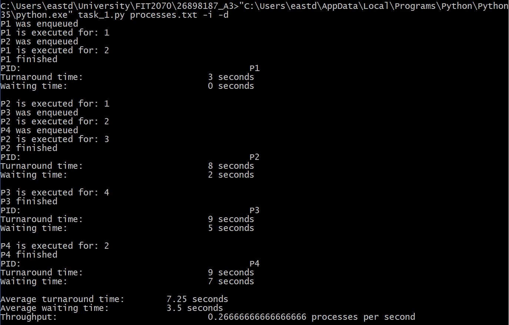

# Process simulator
## FIT2070 Operating Systems Assignment 3
### Installation and running Python tasks
1. Open the *26898187_A3* folder.
2. Open a terminal in the folder, or change into the folder from a previously created terminal.
3. Run the command `python3 `**`<task_x.py>`**` ./processes.txt` where **`<task_x.py>`** the desired assignment task to be run.
4. The specified task should now run and begin outputting the information for the specific program.
**Note:** It is important that you run the program with Python 3 and not Python 2.

#### Extra options
There are two options available that may be added onto the end of the previously stated command:
    - `-i` immediately outputs process information to the console.
    - `-d` prints debugging information output to the console

### Example execution 1

The information of each process is printed out in the order that they finish and finally the average waiting time, turnaround time and throughput are printed at the end.

### Example execution 2

Note that the inclusion of `-d` provides extra information during the execution of the simulation. This may help with checking the correctness of each scheduler algorithm.

### Summary of source code structure and style
#### Important files
- *task_1.py*, *task_2.py* and *task_3.py* contain the scripts to be run to output the process information as specified in the Assignment 3 specification.
- The *./scheduler* directory contains all data pertaining to the scheduler and simulation logic.
- ***fcfs_scheduler.py*:** Specifies the First Come First Served scheduler algorithm.
- ***round_robin.scheduler.py*:** Specifies the Round Robin scheduler algorithm.
- ***srt_scheduler.py*:** Specifies the Shortest Remaining Time scheduler algorithm.

#### Coding style and architecture
The code base makes use of Sphinx Python doc strings; the feature can be utilised to its fullest with many popular IDEs such as PyCharm.
- The observer pattern, supplemented with functional programming (namely, lambda functions), is implemented in the scheduler and process in order to easily modularise what is outputted to the console.
- All schedulers make use of inheritance from a base abstract Scheduler class for easy reuse of code.